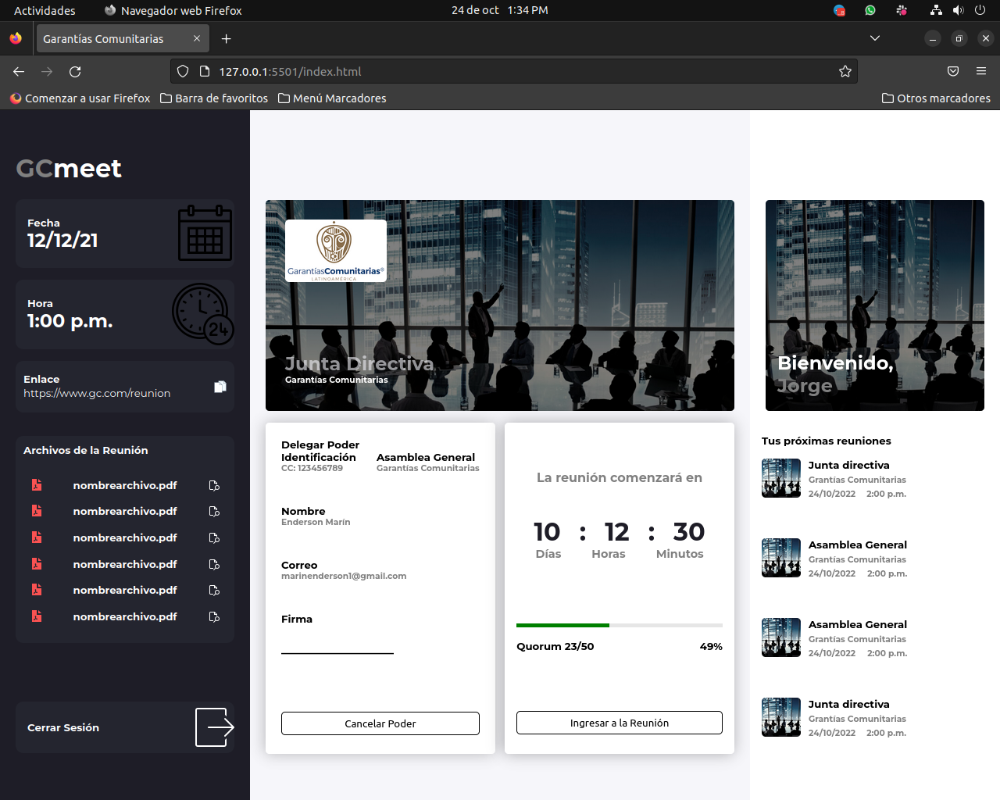

# Project Title
Prueba de Maquetacion
# Screenshot

## Getting Started

# The easiest way to get started is to clone the repository:
git clone https://github.com/ENDERSON-MARIN/BASIC-LAYOUT

# Change directory
cd project_dir

# Then simply start your app
open the file index.html in the browser
or run the live server extensión vs code.

## Author

* [Enderson Marín](https://github.com/ENDERSON-MARIN)

## License

This project is licensed under the MIT License - see the [LICENSE.md](LICENSE.md) file for details

## Web Site:

* https://portafolio-react-enderson-marin.vercel.app/